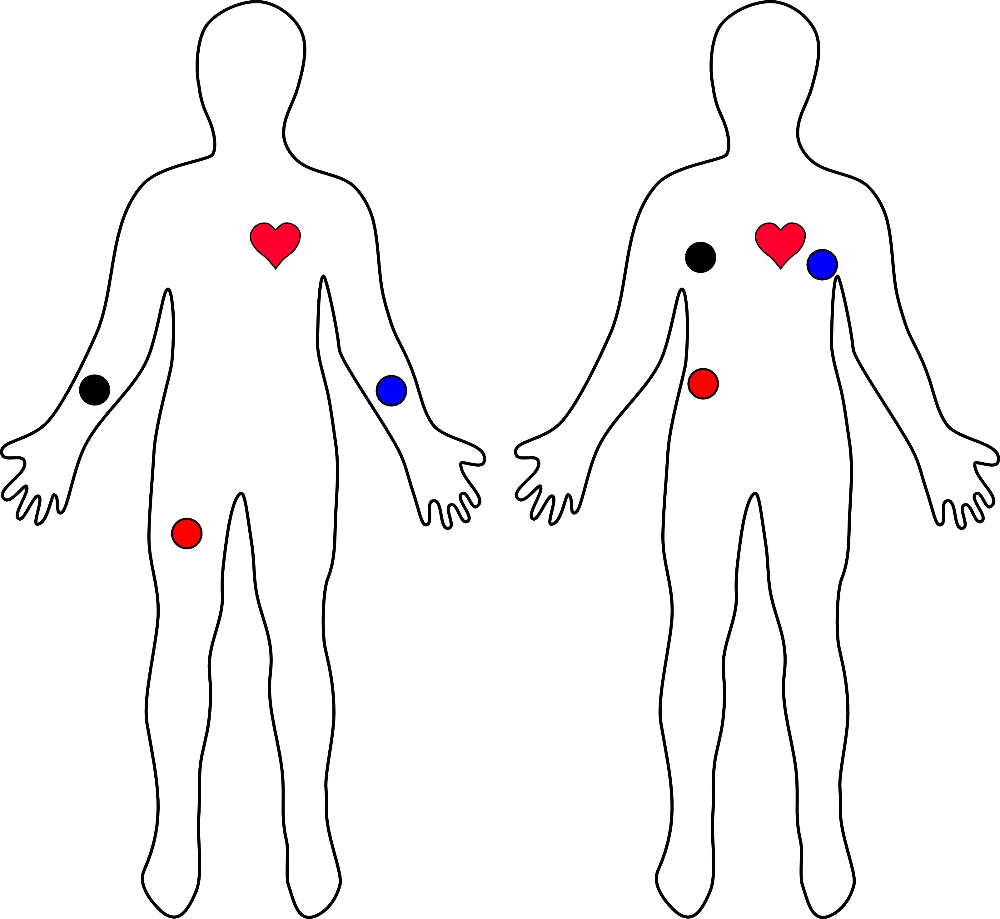

Update: I decided to use ESP32-S3 to read the HR from the Polar H9 sensor as that's easier to wear. Plus, it will sample the data from just one analog ADXL335 and report all of it via the
I2C bus.
Raspberry Pi 5 will read the values from it on the shared I2C bus in its own time.

https://wiki.seeedstudio.com/xiao_esp32s3_getting_started/

This is for Analog Devices HR sensor I might use in future, but it needs more wires, so more difficult to wear.
https://www.analog.com/media/en/technical-documentation/data-sheets/ad8232.pdf

The script is downloaded by using Arduino IDE

On Linux, you might need to:

`sudo usermod -a -G dialout $USER`

and then re-start the session to be able to actually download the sketch onto the device with USB bootloader.

Also, you might need to force the ESP32 into bootloader mode as follows:

- Press and hold the BOOT button on the XIAO.
- While holding BOOT, press and release the RESET button.
- Release the BOOT button.

**Electrode connections**

| Cable Color | Signal        |
|-------------|---------------|
| Black       | RA (Right Arm)|
| Blue        | LA (Left Arm) |
| Red         | RL (Right Leg)|

