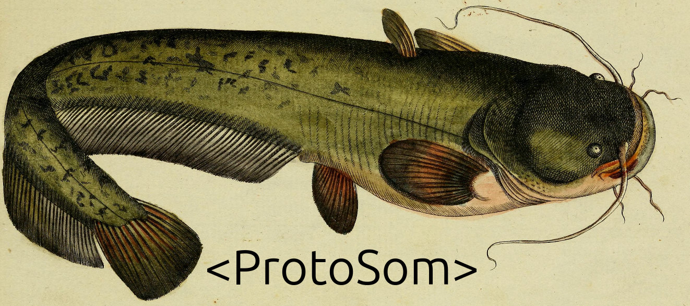

OpenPolysom
===========================

This is an open-source Polysomnography (PSG) physical device and analysis software. It performs what is know as a sleep study.

It runs on an ESP32 microcontroller, and collects these signals from a patient:
- Respiratory Inductance Plethysmography (RIP)
- Nasal air flow rate
- RR intervals (heart rate)
- Sound recording for snoring detection
- Acceleration data from the leg sensors to detect leg twitching

The wiki — an LLM-first knowledge base
===========================
The in-depth documentation lives in an **LLM wiki**: a structured knowledge base written first for AI coding agents to read as working context, and second for humans. It is deliberately [`llms.txt`](https://llmstxt.org/)-shaped — a curated *map* of the project (architecture, data formats, signal processing, settled decisions, roadmap, coding standards) rather than an exhaustive dump — so an agent (or a person) reads the index first and then opens only the pages a task needs. The same Markdown is browsable as a website.

- **Browse it online:** https://sunrise-designs.github.io/OpenPolysom/
- **Read the source:** [`wiki/INDEX.md`](wiki/INDEX.md) — start here
- **Jump straight in:** [architecture](wiki/knowledge/architecture.md) · [data formats](wiki/knowledge/data-formats.md) · [roadmap](wiki/state/roadmap.md)

The Markdown in [`wiki/`](wiki) is rendered to a static site with [Quartz](https://quartz.jzhao.xyz/) and published to GitHub Pages (build: [`web/build.sh`](web/build.sh)).

Why do this?
===========================
It's about creating an _accessible, rapid_ diagnostic pathway for sleep disorders. Many, many people suffer from sleep disorders, breathing-related ones in particular. They have a significant effect on the quality of life, safety (falling asleep while driving) and serious long-term adverse health effects.
The current diagnostic process is abysmally slow on the NHS. There are private routes, but they are financially prohibitive for most.

It's hard to diagnose because:
- Most of the time, the sufferer is unaware of the problem (they only know they are groggy and tired)
- Partners don't know how to tell "normal" snoring, if there's such a thing, from a serious breathing-related sleep disorder
- It's seen as a "specialist" subject in the NHS, and GPs receive hardly any training in this field. They are quick to dismiss fatigue-related complaints
- Even once the person starts looking for a cause, the different avenues to explore are bewildering, expensive, and full of marketing hype
- There is not a streamlined diagnostic pathway, or "one-size-fits-all" solution, because of individual anatomy, neurological comorbidities, lifestyle and so on

What does this aim to do?
===========================
Firstly, this is not a replacement for a qualified medical opinion and treatment.
However, this seeks to:
- Raise awareness. There's not enough awareness around the variety of sleep disorders in the population. There have been huge campaigns around cancers, heart health (which is fantastic), but not this, yet
- Open source, forever. The main, explicit intention of this project is to always remain fully open source, software and hardware
  This means that anyone with enough knowledge can look at data, contribute, validate and build the OpenPolysom
- It aims to be simple enough for a layman to use, but powerful enough for advanced research and clinical diagnostics
- Affordable. There are great polysomnography solutions out there, sure. But they are very expensive, proprietary, and generally only accessible to
state healthcare systems or private clinics. The goal of this project is to be financially affordable to anyone

What is this going to look like?
===========================
The eventual goal is to have an easy-to-use, reusable, affordable polysomnography device and diagnostic infrastructure.
- A patient receives the device, or even builds it themselves
- They wear it for one or more nights
- Quality pre-processed data is recorded onto the device (removable SD card)
- There could be a few ways to analyze the data:
    - Send it to a specialist doctor or a clinician
    - Ask for advice on peer-to-peer forums like Apnea Board
    - Some combination of local and cloud-based algorithm can detect features of a number of breathing-related sleep disorders, like Obstructive Apnea, Central Apnea, UARS, and so on
- The strength of this project is pulling together various bits of science which are out there, but disjoint and difficult to find and use. It aims to make a comprehensive assessment of the data, find a possible problem (if any) and at least suggest possible treatment pathways. This is in no way a substitute for qualified medical advice.

How can it detect sleep disorders?
===========================
It a basic level, it's not so difficult! (The following is a simplified version!)

- If you're snoring away, then you stop, your chest belts show that you are "paradoxically breathing", in other words heaving for air, but there's no airflow - you might have Obstructive Apnea. You tongue or soft palate have collapsed backwards and blocked your airway. Your blood oxygen will also drop.
- There's no airflow, _and_ the chest belts show no movement. Your brain simply "forgot" to breathe! That's Central Apnea. Your blood oxygen wil also drop.
- Your blood oxygen does not drop appreciably, but your heart rate spikes significantly at times during your sleep. Your body has become quite sensitive to "breathing effort", and even though your airway isn't fully obstructed, your sleep is fragmented enough to make you feel terrible. This might be Upper Airway Resistance Syndrome (UARS). You might a completely "healthy" score on an official sleep apnea scale, but this is still a very serious problem!
- Your breathing might be fine, but you twitch lots in your sleep (this can be detected by an accelerometer). This could be Periodic Limb Movement Disorder (PLMD). This can also make you feel very tired.
- You might have none of the above, but you wake up gasping, talking and screaming in your sleep. You might be suffering from nightmares!
- And so on!

The point it, it takes a confluence of all the different signals recorded by the polysomnography device to steer the diagnosis in the correct direction. Recording just one or two things usually is not enough.

Challenges to solve
===========================
**Baseline removal from the RIP signal - the chest belts**

The plan is to achieve that using a combination of Qualitative Diagnostic Calibration (QDC) variant (Marvin Sackner, 1989) and Adaptive Iteratively Reweighted Penalized Least Squares (airPLS)

**Snoring classification and feature extraction**

The end game would be to achieve accurate classification of anatomical snoring site according to the VOTE (Velum, Oropharynx, Tongue base, and Epiglottis). This could be achieved using MFCC/Mel feature extraction, then a fast real time ML model trained on the MPSSC (Munich-Passau Snore Sound Corpus) data.

**Air flow signal processing**

I have not yet recorded a sample signal, but I am guessing there will be pretty standard noise filtering involved

**Porting from Raspberry Pi 5 to ESP32 C6**

It's nice being able to harness amazing processing power of RPi5, but it's not a long term solution. The code will need to run on RISC-V code of the ESP32 chip.
It does not have to do all the signal processing in real time, that can be done later, but I'd like to all I can in real-time (subject to acceptable battery life)

**Medical software compliance**

Even though this is early days, and it's an open-source project designed to be accessible to all, I am aiming for the highest standards of code quality and traceability. This means effectively designing this software to IEC 62304 (Medical Software). This entails version traceability, comprehensive test coverage, demonstrable reproducibility, and so on.

What hardware does this expect
----------------------------
The hardware is currently a breadboard prototype, however a custom PCB is being developed in Kicad. See [hardware](/Hardware) folder.

The breadboard features (for now)
- LDC1612 inductance-to-frequency sensor on I2C bus with address 0x2B
- SDP800-125Pa Digital DP sensor (±125 Pa) (I2C address 0x25 or 0x26)
- Two MMA8451 accelerometers (with different I2C addresses)
- Polar H9 heart rate sensor via BLE

How to build
----------------------------
TODO - work in progress, lots has changed

Why a Som?
===========================
"Som" is a shorthand for polysomnography, and "Som" in Russian is a Wels catfish, _Silurus glanis_. I think it looks cool and terrifying in equal measure. Its whiskers also make me think of all the various probes and electrodes which feature on a polysomnography machine.

Disclaimer
===========================
This software is for informational and educational purposes only. It is not a medical device and is not intended to diagnose, treat, cure, or prevent any disease or sleep disorder.

Not Professional Advice: The outputs generated by this software should not be used as a substitute for professional medical advice, diagnosis, or treatment.

Consult a Physician: Always seek the advice of a qualified healthcare provider with any questions you may have regarding a medical condition.

No Liability: The developers and contributors provide this software "as is" and are not responsible for any actions taken based on its results.

References and inspiration
===========================
This software uses (heavily modified)
https://github.com/Seeed-Studio/Seeed_LDC1612